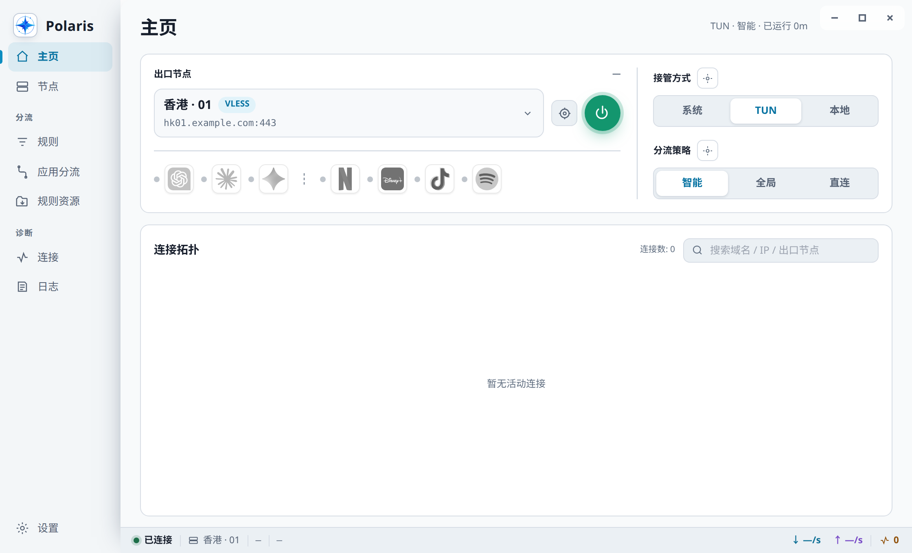
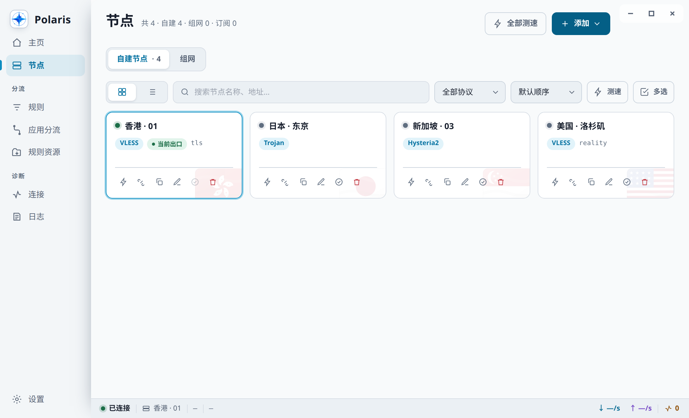
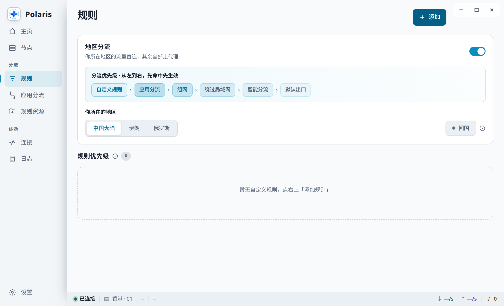
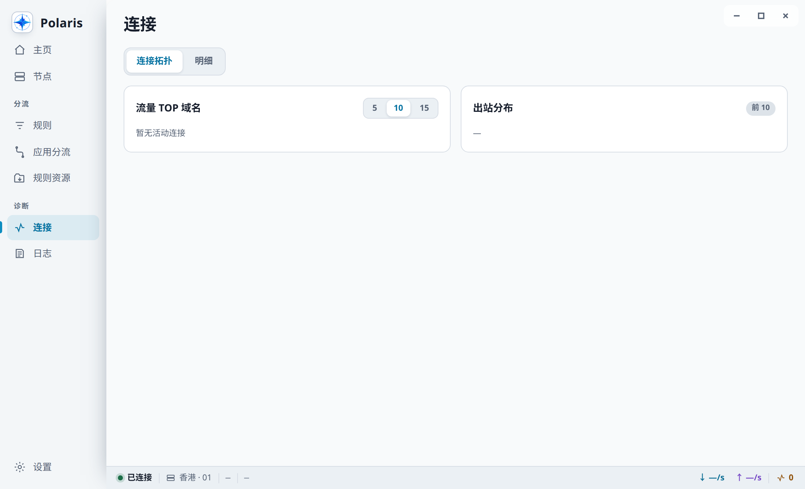
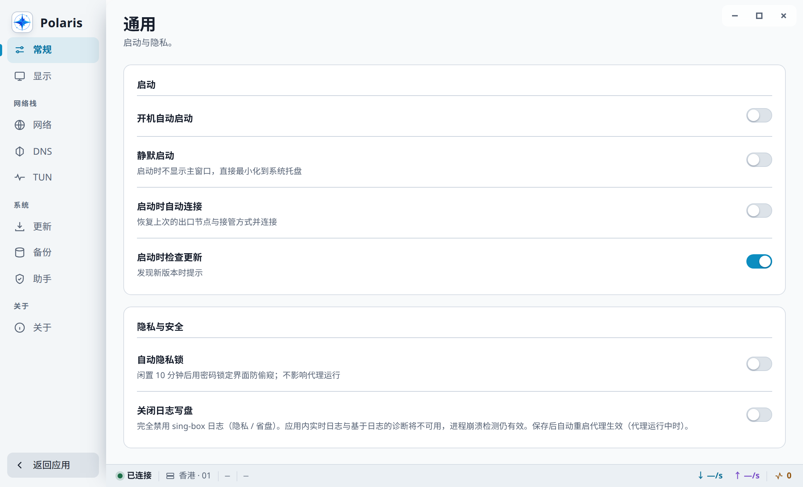

# Polaris

**北极星** — 基于 sing-box 的跨平台网络代理客户端。Tauri 2（Rust + React）。



## 功能

| 领域 | 能力 |
|---|---|
| 接管方式 | TUN · 系统代理 · 本地端口 |
| 分流 | 智能 / 全局 / 直连 · 自定义规则 · 应用分流 · 地区分流（含回国） |
| 协议 | VLESS · VMess · Trojan · Hysteria 2 / 1 · TUIC · Shadowsocks · AnyTLS · Naive · Snell · SOCKS · HTTP · SSH · Tor · OpenConnect · OpenVPN |
| 组网 | WireGuard · Tailscale · WARP；OpenConnect / OpenVPN 声明了内网段后同样归入 |
| DNS | FakeIP · DoH / DoT · 解析竞速 · IPv6 策略 · 泄漏防护 |
| 诊断 | 连接拓扑 · 实时日志 · 节点测速 · 流媒体与 AI 解锁检测 |
| 运维 | 订阅管理 · 内核在线更新 · 配置备份恢复 · 隐私锁 · 托盘驻留 |

<table>
<tr>
<td width="50%"><br><sub>节点管理与测速</sub></td>
<td width="50%"><br><sub>自定义分流规则</sub></td>
</tr>
<tr>
<td><br><sub>实时连接</sub></td>
<td><br><sub>设置</sub></td>
</tr>
</table>

## 安装

从 [Releases](https://github.com/Sway-Chan/polaris/releases) 下载对应平台安装包。

| 平台 | 文件 |
|---|---|
| macOS | `*-mac-arm64.dmg` / `*-mac-x64.dmg` |
| Windows | `*-win-setup.exe`；离线环境用 `*-offline-setup.exe`；免安装用 `polaris-portable-*.zip` |
| Linux | `*.deb` / `*.AppImage` |

安装包当前不做付费代码签名，首次启动需按平台放行。

### macOS 首次安装

1. 打开 DMG，把 `Polaris.app` 拖到「应用程序（Applications）」；不要直接在 DMG 中运行。
2. 打开「终端」，执行：

   ```bash
   xattr -cr /Applications/Polaris.app
   ```

3. 从「应用程序」启动 Polaris。上述命令只需在首次手动安装时执行一次；应用内更新会自行清理隔离属性。

如果 Polaris 安装在其他目录，请把命令中的路径换成实际 `.app` 路径。`xattr -cr` 会递归清除该应用包的
扩展属性，请仅对从本仓库 Releases 下载并确认可信的 Polaris 安装包执行。DMG 根目录也附有同内容的
中英文首次打开引导；若只是提示「无法验证开发者」，也可在 Finder 中右键 Polaris →「打开」→ 再次确认。

### Windows 首次安装

SmartScreen 提示时选择「更多信息」→「仍要运行」。

## 构建

需要 Rust stable、Node 20+、[Tauri CLI 2](https://v2.tauri.app/)。

```bash
node scripts/fetch-core.mjs        # 拉 sing-box 内核（SHA256 钉扎）
node scripts/fetch-cronet.mjs      # 拉 libcronet
cargo tauri build --config src-tauri/tauri.linux.conf.json
```

内核不入库，打包前必须拉。平台 `--config` 不可省：缺了会打出**没有内核的包**，且构建期零报错，
直到运行期才暴露。完整说明、CI 分工、Windows 双安装器与更新器选包契约见
[构建与打包](docs/build-and-package.md)。

开发门禁：

```bash
cargo fmt --all -- --check
cargo clippy --workspace --all-targets -- -D warnings
cargo test --workspace
cd ui && npm test
```

## 架构

```
ui/          React + Zustand + Vite + Tailwind
src-tauri/   Tauri 2 主进程
crates/      17 个 domain crate（config-engine / core-supervisor / helper / updater / …）
resources/   sing-box 内核 + libcronet（构建期拉取，不入库）
```

内核以 sidecar 子进程运行，经 gRPC 管理面通信。TUN 与系统代理由三平台特权 helper 承担
（macOS / Windows / Linux，全 Rust）。

## 文档

| 文件 | 内容 |
|---|---|
| [docs/build-and-package.md](docs/build-and-package.md) | 构建、CI、打包不变量、更新器选包契约 |
| [docs/troubleshooting.md](docs/troubleshooting.md) | 不签名说明、白屏 / 花屏 / GPU 崩溃排障 |

截图由 `node scripts/capture-screenshots.mjs` 生成：无头 Chrome 渲染前端构建产物 + 注入桩数据，
不需要装应用或起内核。

## 上游

| 项目 | 用途 |
|---|---|
| [sing-box](https://github.com/SagerNet/sing-box) | 代理内核（sidecar 子进程） |
| [Tauri 2](https://github.com/tauri-apps/tauri) | 桌面运行时 |
| [cronet-go](https://github.com/SagerNet/cronet-go) | NaiveProxy 的 libcronet |
| [sing-box-dashboard](https://github.com/SagerNet/sing-box-dashboard) | 内置面板 |
| [meta-rules-dat](https://github.com/MetaCubeX/meta-rules-dat) | 规则集与地理数据（`.srs`） |

各组件版权归其作者。以子进程 / 二进制形式集成的组件见 `NOTICE`；链进产物的源码级依赖
（Tauri / React / 数百个 Rust crate）逐包登记在 `THIRD-PARTY-LICENSES.md`。

## 许可

MIT（见 `LICENSE`）。sing-box（GPLv3）以 sidecar 子进程形式集成（mere aggregation），
不影响本项目许可；第三方组件见 `NOTICE`。
